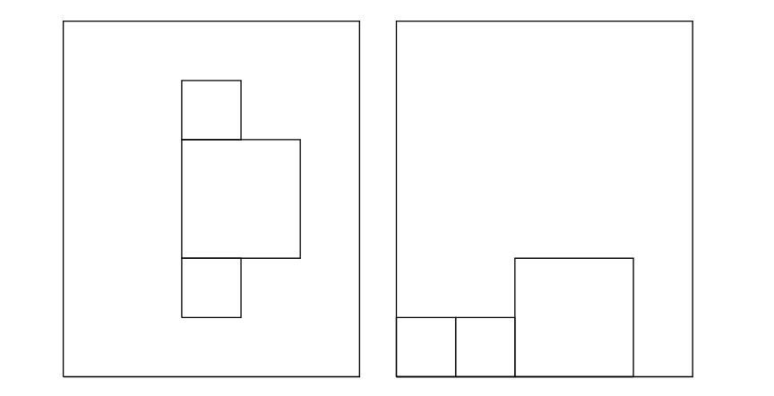

# Roblocks

In una stanza di dimensioni `m × n` ci sono degli scatoloni `b₁, ..., bₖ`. Gli scatoloni sono tutti quadrati ma hanno dimensioni del lato diversa (intera) `s₁, ..., sₖ`. Sono note le posizioni dei vertici più in basso e a sinistra delle scatole. Il magazziniere ha a disposizione la mossa `move(sᵢ, d)` dove `d` denota la direzione (`n`, `s`, `w`, `o`). 

Gli spostamenti sono unitari, ma è possibile **solo spingere**, non tirare. Dunque, se un blocco finisce nel bordo destro o sinistro, non potrà più essere spostato orizzontalmente. Una mossa non si può fare se la posizione di arrivo della mossa stessa è già occupata.

L'obiettivo è quello di ammassare gli scatoloni in basso partendo dall'angolo a sinistra. Se lo spazio nella base non fosse sufficiente, si continua ad inserire via via più in alto (stile tetris). In tal caso, si vuole **minimizzare la massima altezza utilizzata** (con i tipi di blocchi del disegno sotto, se ce ne fossero tanti, sarebbe meglio mettere un blocco piccolo sopra uno piccolo che sopra uno grosso).

Per ogni istanza affronteremo due problemi:

1. Prima si trova una sistemazione ottima indipendentemente dal fatto che si possa raggiungere con le mosse `move` descritte (ignorando quindi la pianificazione).

2. Poi trovate un piano (sequenza di mosse) che **minimizza l'altezza**. Per farlo potreste utilizzare il bound ottenuto al punto precedente.

Ecco un possibile input, la sua visualizzazione e un possibile output:
- `m = 5`, `n = 6`
- Posizioni per le scatole di dimensione 1: `(2, 1)`, `(2, 4)`
- Posizione per la scatola di dimensione 2: `(2, 3)`

Obiettivi:

1. Scrivere un programma ASP che modella e risolve il problema.

2. Prepara 100 casi test di benchmark con dimensioni crescenti di blocchi e dimensioni. Cerca di creare degli scenari ragionevoli.

3. Lanciare il programma ASP su tutte le istanze. Prova diverse strategie di ricerca. Usa un timeout di 5 minuti (es., --time-limit in clingo) per ciascun test.

4. Scegli una configurazione che richiede un paio di minuti per trovare la soluzione. Prova diverse configurazioni del solver. Scegli la configurazione migliore per risolvere le istanze più difficili e documenta il miglioramento.

5. Scrivere un report di 6-10 pagine che descrive i modelli, le scelte implementative fatte, i risultati e i tempi ottenuti. Prepara programmi, dataset e report in un file zip.
